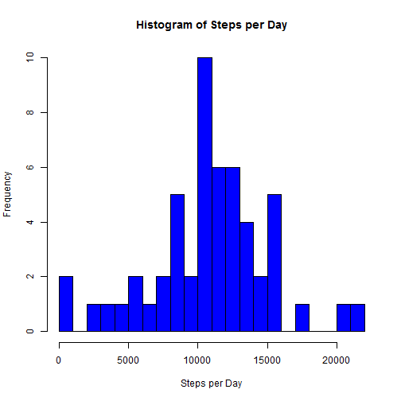
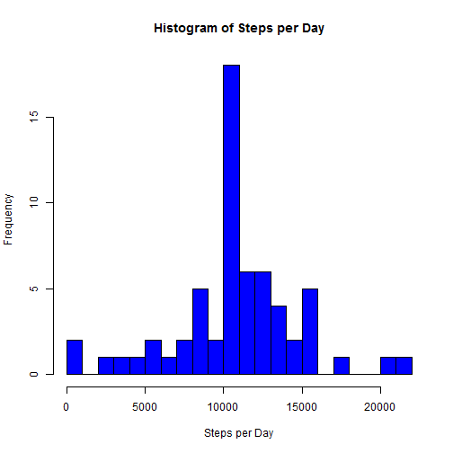

## Loading and preprocessing the data
The activity data were first extracted from the activity zip archive included in the RepData_PeerAssessment1 fork from 
https://github.com/rdpeng/RepData_PeerAssessment1

The activity.csv file is assumed to exist in the current directory.


```r
library(lattice) ## We will need this for plotting
active <- read.csv("activity.csv",stringsAsFactors = FALSE) ## read in the complete dataset from csv
active$date<-as.Date(active$date,"%Y-%m-%d") ## Convert strings to dates
active2<-active[complete.cases(active),] ## remove NAs
```
## What is mean total number of steps taken per day?
Aggregate and plot a histogram of the total number of steps taken per day.

```r
ahist<-aggregate(active2$steps,by=list(active2$date),FUN=sum)
colnames(ahist)<-c("interval","sum") ## Give the columns meaningful names
hist(ahist$sum,xlab="Steps per Day",main="Histogram of Steps per Day",col="blue",breaks=20)
```

 

What is the daily mean?

```r
mean(ahist$sum)
```

```
## [1] 10766.19
```

What is the daily median?

```r
median(ahist$sum)
```

```
## [1] 10765
```
## What is the average daily activity pattern?
Aggregate and plot the mean number of step taken per interval averaged over all days.

```r
ahist2<-aggregate(active2$steps,by=list(active2$interval),FUN=mean)
colnames(ahist2)<-c("interval","mean") ## Give the columns meaningful names
plot(ahist2$interval,ahist2$mean,type="l",xlab="Interval",ylab="Mean Steps",main="Mean Steps per Interval", col="blue")
```

 

Which 5-minute interval, on average across all the days in the dataset, contains the maximum number of steps?

```r
active2[which.max(active2$steps),]
```

```
##       steps       date interval
## 16492   806 2012-11-27      615
```

## Imputing missing values
Calculate the number of missing step measures

```r
sum(is.na(active$steps))
```

```
## [1] 2304
```

For fun, make sure there are no missing interval labels or dates

```r
sum(is.na(active$interval))
```

```
## [1] 0
```

```r
sum(is.na(active$date))
```

```
## [1] 0
```

This report will use the mean of each interval to inpute missing steps values.
First merge the original dataset with an aggregrate of the mean steps by interval (ahist2) to line up (that is index) steps with mean steps by interval. Get a vector of indices where steps == NA. then use those indices to update steps to the mean for the interval only for NAs.

```r
mrg<-merge(active,ahist2) ## merge active with ahist2 to line up steps (active$steps) with mean steps by interval (ahist2$mean)
nandx<-which(is.na(mrg$steps)) ## Get a vector of indices for the NA rows
mrg[nandx,2]<-mrg[nandx,4] ## replace steps with mean steps by interval where steps == NA
```

Aggregate and plot a histogram of the total number of steps taken per day with the data inputed for NAs.

```r
ahist3<-aggregate(mrg$steps,by=list(mrg$date),FUN=sum)
colnames(ahist3)<-c("interval","sum") ## Give the columns meaningful names
hist(ahist3$sum,xlab="Steps per Day",main="Histogram of Steps per Day",col="blue",breaks=20)
```

 

What is the daily mean of the new dataset?

```r
mean(ahist3$sum)
```

```
## [1] 10766.19
```

What is the daily median of the new dataset?

```r
median(ahist3$sum)
```

```
## [1] 10766.19
```
The mean is the same, which makes sense because we added in means.
The median changed slightly.
   
For fun, calculate the standard deviation for the original (ahist) and dataset with imputed values (ahist3).

```r
sd(ahist$sum)
```

```
## [1] 4269.18
```

```r
sd(ahist3$sum)
```

```
## [1] 3974.391
```
From the histogram and the standard deviation, we can see the data with imputed values are clustered closer to the mean, which is why imputed dataset picked up the mean as the median.


## Are there differences in activity patterns between weekdays and weekends?

Using imputed data, create a panel plot with "weekend" and "weekday" panels, plotting mean number of steps vs. the interval.

```r
mrg$day<-weekdays(mrg$date) ## add a weekdays field to the data calculated from active$date
mrg$endVday<-"weekday" ## default to the day being a weekday
mrg[mrg$day %in% c("Saturday","Sunday"),6]<-"weekend" ## Update Saturdays and sundays to be weekdays
mrg$endVday<-as.factor(mrg$endVday) ## Coerce weekend vs weekday to be a factor
whist<-aggregate(mrg$steps,by=list(mrg$interval,mrg$endVday),FUN=mean) ## Find the mean steps by interval and weekend
colnames(whist)<-c("interval","endVday","mean") ## create meaningful colum names
xyplot(whist$mean~whist$interval|whist$endVday,type="l",xlab="Interval",ylab="Number of steps",layout=c(1,2))
```

 
